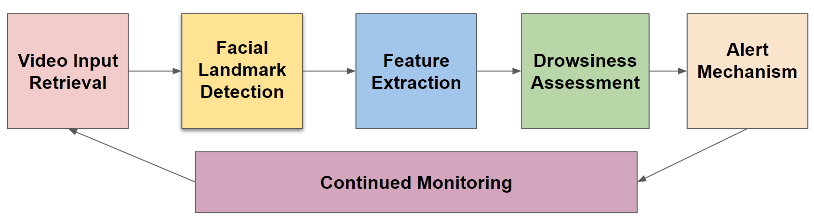

# Real-Time Drowsiness Detection

Detecting Drowsiness in Drivers through Real-time Video Analysis. The primary objective of this task is to develop a robust system capable of detecting and preventing drowsy driving by analyzing real-time video footage obtained from camera sensors focused on the driver's face. 

## Built With

- OpenCV Library
- imutils library
- Dlib library
- scikit-learn library
- NumPy

## Getting Started

These instructions will help you set up and run the project on your local machine for development and testing purposes.

## Prerequisites

- Install and set up Python 3.
- Install cmake in your system

## Running the Application

1. Move into the project directory and Install all the required libraries, by installing the requirements.txt file.
   ```
   pip install -r requirements.txt
   ```
2. Run the Inference model.
   ```
   python drowsiness_detector.py
   ```
3. After the video capturing and drowsiness in real-time detected, break the video by clicking "b".
   
## Algorithm


- Video Input Retrieval: 
  - The process starts by capturing real-time video feed from dedicated camera sensors, concentrating on the driver's face, ensuring a continuous retrieval of video frames at a set rate.
- Facial Landmark Detection: 
  - The video frames retrieved are analyzed through computer vision techniques like OpenCV facial landmark model, mapping key facial landmarks(like eyes & mouth) critical for evaluating drowsiness.
- Feature Extraction: 
  - Using the detected landmarks, the system extracts crucial facial movements, analyzing parameters such as eye closures, blink frequency, and yawning actions to identify drowsiness indicators.
- Drowsiness Assessment: 
  - The system assesses the driver's drowsiness level by analyzing the extracted features, deciding if the detected signs surpass a predefined threshold indicating drowsiness.
- Alert Mechanism: 
  - When signs of drowsiness are detected, the system triggers alerts through audible warnings ensuring the driver's attention is drawn to their drowsy state.
- Continued Monitoring: 
  - The system continously monitors the driver's facial expressions and movements to assess drowsiness levels, ensuring ongoing vigilance.

Testing and Results in Real-World Scenario:
The tests were conducted in various conditions including:
- Different lighting conditions.
- Driver's posture and position of the automobile driver's face.
- Drivers with spectacles.

